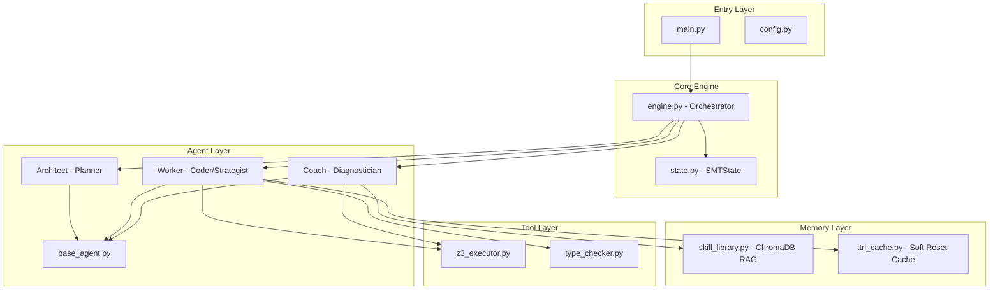
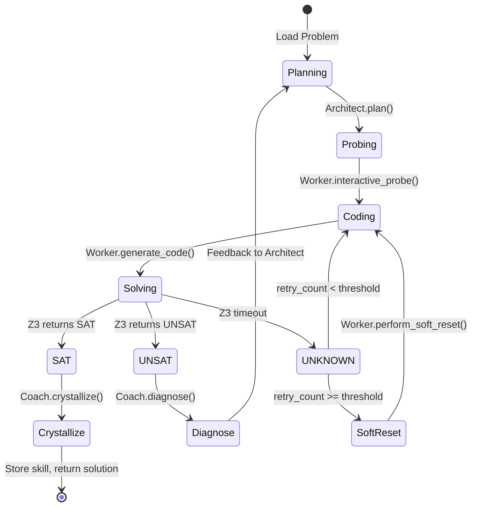

# Agentic-Z3 System Scaffold Plan

## Architecture Overview



## State Machine Flow



## File Structure and Implementation Details

### 1. Root Level Files

**[main.py](main.py)** - Entry point

- CLI interface using `argparse` for problem input (file or stdin)
- Initialize `Engine` with configuration
- Handle graceful shutdown and result reporting

**[config.py](config.py)** - Configuration constants

- `MAX_TTRL_RETRIES = 5` - Maximum retry iterations
- `SOFT_RESET_THRESHOLD = 3` - Consecutive failures before soft reset
- `Z3_TIMEOUT = 5000` (ms) - Solver timeout
- `LLM_MODEL`, `LLM_TEMPERATURE`, `CHROMA_PERSIST_PATH`
- Pydantic `Settings` class for environment variable loading

**[requirements.txt](requirements.txt)** - Dependencies

- `z3-solver>=4.12.0`, `openai>=1.0.0`, `chromadb>=0.4.0`
- `pydantic>=2.0`, `pydantic-settings>=2.0`

### 2. Core Layer (`agentic_z3/core/`)

**[agentic_z3/core/state.py](agentic_z3/core/state.py)** - Shared state between agents

```python
class ExecutionStatus(Enum):
    PENDING, SAT, UNSAT, UNKNOWN, ERROR

@dataclass
class SMTState:
    problem_description: str
    plan_blueprint: dict  # {variables: [...], constraint_groups: [...]}
    current_code: str
    execution_status: ExecutionStatus
    unsat_core_dump: list[str]
    retry_count: int
    failure_summaries: list[str]  # For soft reset context
    probe_results: dict  # Type verification results
```

**[agentic_z3/core/engine.py](agentic_z3/core/engine.py)** - Main orchestration loop

- `solve(problem: str) -> SMTState` - Main entry method
- State machine implementation with transitions:

                                1. `Planning` → Call `Architect.plan()`
                                2. `TTRL Loop` → `Worker.generate_and_probe()` with retry logic
                                3. `SAT` → `Coach.crystallize()` → Return solution
                                4. `UNSAT` → `Coach.diagnose()` → Feedback to Architect → Restart
                                5. `UNKNOWN` (timeout) → Check threshold → `Worker.perform_soft_reset()`

### 3. Agent Layer (`agentic_z3/agents/`)

**[agentic_z3/agents/base_agent.py](agentic_z3/agents/base_agent.py)** - LLM interaction base

- `BaseAgent` class with OpenAI client initialization
- `_call_llm(messages, temperature, json_mode)` - Core LLM call
- `_reset_conversation()` - Clear message history (for soft reset)
- Message history management with system prompt injection

**[agentic_z3/agents/architect.py](agentic_z3/agents/architect.py)** - Hierarchical Planner

- `create_blueprint(problem, feedback=None) -> dict`
                                - Returns JSON with `{variables: [{name, type, description}], constraint_groups: [{name, constraints, dependencies}]}`
                                - Does NOT generate Python code - purely structural planning
- `generate_warmup_curriculum(problem) -> list[dict]`
                                - When problem complexity > threshold, generate 3 simplified variants
                                - Progressively reduce: variable count, constraint complexity, numeric bounds
- `refine_blueprint(blueprint, diagnosis) -> dict`
                                - Incorporate Coach's conflict analysis to restructure plan

**[agentic_z3/agents/worker.py](agentic_z3/agents/worker.py)** - Coder with TTRL

- `interactive_probe(blueprint) -> ProbeResult`
                                - Generate minimal type-checking script (just variable declarations + basic assertions)
                                - Execute via `z3_executor` with short timeout
                                - Return type compatibility report
- `generate_code(blueprint, probe_result, skills) -> str`
                                - Retrieve relevant skills from library
                                - Generate full Z3 Python script with named constraints for unsat core tracking
- `perform_soft_reset(state) -> None`
                                - **Key Innovation**: Clear LLM conversation history BUT retain:

                                                                1. Original problem statement
                                                                2. Compressed failure summary (why previous N attempts failed)

                                - Boost temperature from `0.2` → `0.7` to force exploration diversity
                                - Reset `retry_count` but keep `failure_summaries` for context

**[agentic_z3/agents/coach.py](agentic_z3/agents/coach.py)** - Diagnostician and Librarian

- `analyze_unsat_core(core_list, blueprint) -> str`
                                - Map constraint names (e.g., `c_1`, `c_boundary_3`) back to blueprint groups
                                - Generate natural language: "Constraint 'Capacity' conflicts with 'TimeLimit'"
                                - Identify which constraint groups need restructuring
- `crystallize_skill(code, blueprint) -> SkillTemplate`
                                - Regex replace literals with placeholders (`100` → `{{PARAM_A}}`)
                                - Extract constraint patterns as reusable templates
                                - Store with metadata (problem type, variable types, success rate)
- `diagnose(state) -> DiagnosisReport`
                                - Combine error messages + unsat core analysis + execution history
                                - Produce actionable feedback for Architect

### 4. Memory Layer (`agentic_z3/memory/`)

**[agentic_z3/memory/skill_library.py](agentic_z3/memory/skill_library.py)** - ChromaDB-backed RAG

- `SkillLibrary` class wrapping ChromaDB client
- `store(template, metadata)` - Embed and persist skill skeleton
- `retrieve(query, top_k=3) -> list[SkillTemplate]` - Semantic search
- `update_success_rate(skill_id, success: bool)` - Track effectiveness

**[agentic_z3/memory/ttrl_cache.py](agentic_z3/memory/ttrl_cache.py)** - Soft Reset Cache

- `TTRLCache` class for inference-time state
- `record_attempt(code, result, error)` - Log each TTRL iteration
- `get_failure_summary() -> str` - Compressed summary of failed paths
- `should_trigger_soft_reset() -> bool` - Check consecutive failure count
- `clear_for_new_problem()` - Reset between problems

### 5. Tool Layer (`agentic_z3/tools/`)

**[agentic_z3/tools/z3_executor.py](agentic_z3/tools/z3_executor.py)** - Z3 Interface

- `run_with_unsat_core_tracking(code) -> ExecutionResult`
                                - Inject `s.set(unsat_core=True)` if not present
                                - Parse constraint names from unsat core output
                                - Return `{status, model, unsat_core, error}`
- `check_sat_with_timeout(code, timeout_ms) -> ExecutionResult`
                                - Use `z3.set_param('timeout', timeout_ms)`
                                - Sandbox execution with subprocess for safety
                                - Capture stdout/stderr and parse results
- **`preprocess_for_tracking(code) -> str`** (Critical Safety Net for `assert_and_track`)
                                - Regex conversion: `solver.add(expr)` → `solver.assert_and_track(expr, "c_auto_N")`
                                - Detect and rename duplicate constraint names with unique suffix
                                - Validate all constraints are trackable before execution
                                - Log warnings when auto-conversion applied (indicates Worker LLM deviation)
                                - Handle edge cases: multi-line `add()` calls, nested expressions

**[agentic_z3/tools/type_checker.py](agentic_z3/tools/type_checker.py)** - Static Analysis

- `analyze_types(code) -> TypeReport`
                                - AST-based extraction of Z3 variable declarations
                                - Detect type mismatches (Int vs Real operations)
- `validate_against_blueprint(code, blueprint) -> list[TypeError]`
                                - Cross-reference declared types with blueprint spec
                                - Return list of violations with line numbers

### 6. Utils (`agentic_z3/utils/`)

**[agentic_z3/utils/logger.py](agentic_z3/utils/logger.py)** - Structured Logging

- Custom formatter with categories: `[AGENT]`, `[Z3]`, `[SYSTEM]`
- Color-coded output for terminal
- JSON mode for structured log aggregation
- Log levels per category (verbose agent thoughts vs. concise system status)

**[agentic_z3/utils/prompter.py](agentic_z3/utils/prompter.py)** - Prompt Management

- `PromptManager` class with templates for each agent role
- System prompts defining agent personas and output formats
- Few-shot examples for blueprint generation and skill extraction
- Template rendering with context injection

## Key Implementation Notes

1. **Named Constraints**: All generated Z3 code must use `solver.assert_and_track(constraint, "c_groupname_N")` pattern to enable unsat core mapping.

2. **Soft Reset Mechanism**: The critical insight is that we don't just retry - we fundamentally alter the exploration policy by:

                                                - Wiping conversation history (short-term memory)
                                                - Preserving failure context (what NOT to do)
                                                - Increasing temperature (diversify generation)

3. **Type-Aware Probing**: Before full code generation, a lightweight "probe" script validates that the LLM's understanding of variable types matches Z3's type system.

4. **Skill Crystallization**: Successful solutions are parameterized (concrete values → placeholders) and stored for future retrieval, enabling curriculum learning.

---

## Critical Implementation Safeguards

### A. `assert_and_track` Enforcement (in `z3_executor.py`)

**Problem**: If the Worker LLM generates `solver.add(x > 0)` instead of `solver.assert_and_track(x > 0, "name")`, the unsat core diagnosis completely fails.

**Solution**: Add `preprocess_for_tracking(code: str) -> str` function:

```python
def preprocess_for_tracking(code: str) -> str:
    """
    Safety net: Convert any solver.add() calls to solver.assert_and_track()
    with auto-generated unique constraint names. This ensures unsat core
    tracking works even if the LLM forgets the correct pattern.
    
    Pattern: solver.add(expr) -> solver.assert_and_track(expr, "c_auto_N")
    Also detects duplicate names and auto-suffixes them.
    """
    import re
    counter = [0]  # Mutable for closure
    seen_names = set()
    
    def replace_add(match):
        counter[0] += 1
        expr = match.group(1)
        return f'solver.assert_and_track({expr}, "c_auto_{counter[0]}")'
    
    # Convert solver.add(...) to tracked version
    code = re.sub(r'solver\.add\(([^)]+)\)', replace_add, code)
    
    # Detect and fix duplicate constraint names
    # ... (dedupe logic with _1, _2 suffixes)
    return code
```

**Additional Validation**: Add a linter check in Worker's code generation that warns/rejects code missing `assert_and_track`.

### B. Soft Reset Context Reconstruction (in `worker.py`)

**Problem**: Simply clearing `messages[]` loses the problem definition, causing the LLM to hallucinate.

**Solution**: `perform_soft_reset()` must explicitly reconstruct context:

```python
def perform_soft_reset(self, state: SMTState) -> None:
    """
    Triggers exploration diversity by clearing short-term memory while
    preserving essential context. This is NOT a simple retry.
    
    Context Reconstruction Order:
 1. System Prompt (agent role definition) - ALWAYS first
 2. Original Problem Statement - re-injected verbatim from state
 3. Failure Summary - compressed insights from ttrl_cache
 4. Explicit instruction: "Previous approaches failed. Try fundamentally different strategy."
    
    Temperature Boost: 0.2 -> 0.7 to force generation diversity
    """
    # Get compressed failure summary BEFORE clearing
    failure_summary = self.ttrl_cache.get_failure_summary()
    
    # Clear conversation history (wipe failed attempts)
    self._reset_conversation()
    
    # Reconstruct minimal context
    self.messages = [
        {"role": "system", "content": self.system_prompt},
        {"role": "user", "content": f"Problem: {state.problem_description}"},
        {"role": "user", "content": f"FAILED APPROACHES (avoid these):\n{failure_summary}"},
        {"role": "user", "content": "Generate a FUNDAMENTALLY DIFFERENT solution strategy."}
    ]
    
    # Boost temperature for diversity
    self.temperature = 0.7
```

**Key Invariant**: `state.problem_description` is NEVER modified and serves as the ground truth for reconstruction.